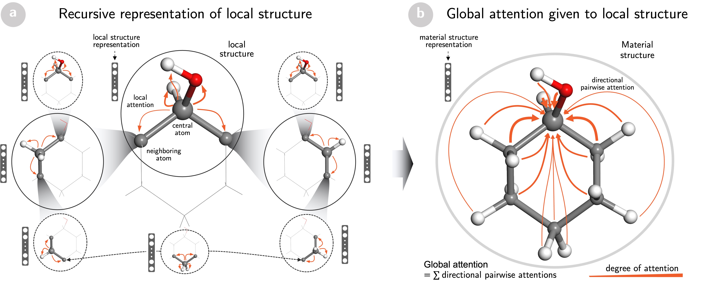
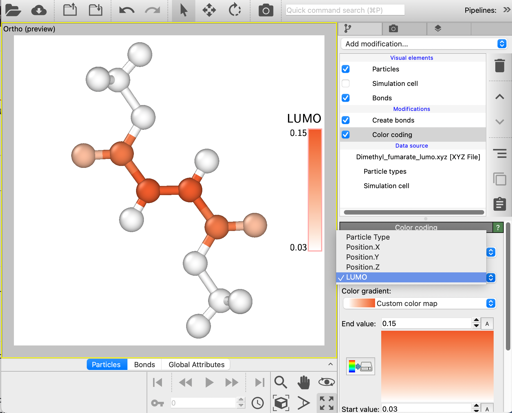

# Table of Contents

* [Introduction](#introduction)
* [SCANN Framework](#scann-framework)
* [Installation](#installation)
* [Usage](#usage)
* [Datasets](#datasets)
* [References](#references)

<a name="introduction"></a>

# Introduction
This repository is the official implementation of [Towards understanding structure–property relations in materials with interpretable deep learning](https://www.nature.com/articles/s41524-023-01163-9).

Please cite us as

```
@article{Vu2023,
doi = {10.1038/s41524-023-01163-9},
issn = {2057-3960},
journal = {npj Computational Materials},
number = {1},
pages = {215},
title = {{Towards understanding structure–property relations in materials with interpretable deep learning}},
url = {https://doi.org/10.1038/s41524-023-01163-9},
volume = {9},
year = {2023}
}
```

We developed a `Self-Consistent Atention-based Neural Network (SCANN)` that takes advantage of a neural network to quantitatively capture
the contribution of the local structure of material properties.

The model captures information on atomic sites
and their local environments by considering self-consistent long-range interactions to enrich the structural
representations of the materials. A comparative experiment was performed on benchmark datasets QM9 and Material Project (2018.6.1) to compare the performance of the proposed model with state-of-the-art representations in terms of prediction accuracy
for several target properties.

Furthermore,
the quantitative contribution of each local structure to the properties of the materials can help understand
the structural-property relationships of the materials.

<a name="DeepAt-framework"></a>

# SCANN framework

The Self-Consistent Atention-based Neural Network (SCANN) is an implementation of deep attention mechanism for materials science.

Figure 1 shows the overall schematic of the model


<div align='center'><strong>Figure 1. Schematic of  SCANN.</strong></div>

<a name="usage"></a>

# Installation

Firstly, create a conda environment to install the package, for example:
```
conda create -n test python==3.9
source activate test
```

### Optional GPU dependencies

For hardwares that have CUDA support, the <b>tensorflow version with gpu options</b> should be installed. Please follow the installation from https://www.tensorflow.org/install for more details.

Tensorflow can  also be installed from ```conda``` for simplification settings:
```
conda install -c conda-forge tensorflow-gpu
```

#### Method 1 (directly install from git)
You can install the lastes development version of SCANN from this repo and install using:
```
git clone https://github.com/sinhvt3421/scann-material
cd scann-material
python -m pip install -e .
```

#### Method 2 (using pypi)
SCANN can be installed via pip for the latest stable version:
```
pip install scann-model
```

# Usage

Our current implementation supports a variety of use cases for users with
different requirements and experience with deep learning. Please also visit
the [notebooks directory](notebooks) for Jupyter notebooks with more detailed code examples.

Below is an example of predicting the "HOMO" and corresponding global attention score:

```python
from scann.utils import load_file, prepare_input_pmt
from scann.models import SCANN
import yaml

#load config and pretrained model from folders

config = yaml.safe_load(open('trained_model/homo/config.yaml'))
scann = SCANN(config, pretrained='trained_model/homo/model_homo.h5', mode='infer')

#load file for structure using pymatgen Structure 

struct = load_file('abc.xyz') # pymatgen.core.Structure 
inputs = prepare_input_pmt(struct, d_t=4.0, w_t=0.4, angle=False)  # Distance, weights threshold

# Predict the target property with the ga score for interpretation
pre_target, ga_score = scann.model.predict(inputs)

```

## Using pre-built models

In our work, we have already built models for the QM9 [1] and Material Project 2018 [2] datasets . The model is provided as serialized HDF5+yaml files. 

* QM9 molecule data:
  * HOMO: Highest occupied molecular orbital energy
  * LUMO: Lowest unoccupied molecular orbital energy
  * Gap: energy gap
  * α: isotropic polarizability
  * Cv: heat capacity at 298 K

The MAEs on the various models are given below:

### Performance on QM9

| Property | Units      | SCANN   | SCANN<sup>+</sup>|
|----------|------------|-------|-------|
| HOMO     | meV         | 41 | 32 |
| LUMO     | meV         | 37 |31|
| Gap      | meV         | 61 |52|
| α        | Bohr^3     | 0.141|0.115|
| Cv       | cal/(molK) | 0.050 |0.041|

### Performance  on Material Project 2018.6.1

| Property | Units      | SCANN   | SCANN<sup>+</sup>|
|----------|------------|-------|-------|
| Ef     | meV(atom)<sup>-1</sup>        | 29 | 28 |
| Eg     | meV         | 260 |225|


<a name="dataset"></a>

# Datasets

## Experiments

The settings for experiments specific is placed in the folder [configs](configs)

We provide an implementation for the QM9 experiments, the fullerene-MD, the Pt/graphene-MD, Material Project 2018.6.1, and SmFe12-CD [3] experiments.

# Basic usage
## Data preprocessing
For training new model for each datasets, please follow the below example scripts. If the data is not avaiable, please run the code ```preprocess_data.py``` for downloading and creating suitable data formats for SCANN model. For example:
```
$ python preprocess_data.py qm9 processed_data --dt=4.0 --wt=0.4 --p=8

-----

$ python preprocess_data.py mp2018 processed_data --dt=6.0 --wt=0.4 --p=8

```
The data for <b>QM9</b> or <b>Material Project 2018</b> will be automatically downloaded and processed into folder [propessed_data](processed_data). For all avaiable datasets and options for cutoff distance/Voronoi angle, please run ```python preprocess.py --h``` to show all details.

## Model training
After that, please change the config file located in folder [configs](configs) for customizing the model hyperparameters or data loading/saving path.
```
$ python train.py homo configs/model_qm9.yaml --use_drop=True
```

For training dataset fullerene-MD with pretrained weights from QM9 dataset, please follow these steps. The pretrained model will be load based on the path from argument. 
```
$ python train.py homo configs/model_fullerene.yaml --pretrained=.../qm9/homo/models/model.h5
```

For running the evaluation from pretrained weights, please follow these steps.
```
$ python train.py homo ..../qm9/homo/configs.yaml --pretrained=.../qm9/homo/models/model.h5  --mode=eval 
```

## Model inference
The code ```predict_files.py``` supports loading a ```xyz``` file and predicting the properties with the pretrained models. The information about global attention (GA) score for interpreting the structure-property relationship is also provided and saved into ```xyz``` format. Please use a visualization tool such as Ovito [4] for showing the results.
```
$ python predict_files.py ..../models.h5 save_path.../ experiments/molecules/Dimethyl_fumarate.xyz
``` 

<div align='center'><strong>Figure 2. Example of SCANN prediction for LUMO property.</strong></div>

<a name="usage"></a>

<a name="references"></a>
# References

[1] Ramakrishnan, R., Dral, P., Rupp, M. et al. Quantum chemistry structures and properties of 134 kilo molecules. Sci Data 1, 140022 (2014). https://doi.org/10.1038/sdata.2014.22 

[2] Xie, T. & Grossman, J. C. Crystal graph convolutional neural networks for an accurate and interpretable prediction of material properties. Phys. Rev. Lett. 120, 145301 (2018). https://doi.org/10.1021/acs.chemmater.9b01294

[3] Nguyen, DN., Kino, H., Miyake, T. et al. Explainable active learning in investigating structure–stability of SmFe<sub>12-α-β</sub> X<sub>α</sub>Y<sub>β</sub> structures X, Y {Mo, Zn, Co, Cu, Ti, Al, Ga}. MRS Bulletin 48, 31–44 (2023). https://doi.org/10.1557/s43577-022-00372-9

[4] A. Stukowski, Visualization and Analysis of Atomistic Simulation Data with OVITO–the Open Visualization Tool, Model. Simul. Mater. Sci. Eng. 18, 15012 (2009). https://doi.org/10.1088/0965-0393/18/1/015012