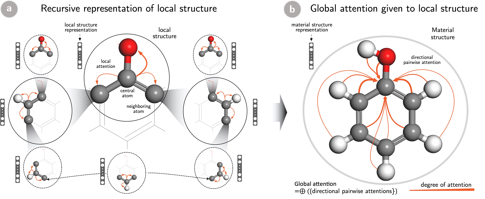

# Table of Contents

* [Introduction](#introduction)
* [SCANNet Model](#DeepAt-framework)
* [Usage](#usage)
* [Datasets](#datasets)
* [References](#references)

<a name="introduction"></a>

# Introduction
This repository is the official implementation of [Deep learning reveals where to pay attention to for interpreting the structure-property relationship of materials](https://).

Please cite us as

```

```

We developed a `Self-Consistent Atention-based Neural Network` that takes advantage of a neural network to quantitatively capture
the contribution of the local structure of material properties.

The model captures information on atomic sites
and their local environments by considering self-consistent long-range interactions to enrich the structural
representations of the materials. A comparative experiment was performed on benchmark dataset QM9 to compare
the performance of the proposed model with state-of-the-art representations in terms of prediction accuracy
for several target properties.

Furthermore,
the quantitative contribution of each local structure to the properties of the materials can help understand
the structural-property relationships of the materials.

<a name="DeepAt-framework"></a>

# SCANNet framework

The Global Attention model Network (GAMNet) is an implementation of deep attention mechanism for materials science

Figure 1 shows the overall schematic of the model


<div align='center'><strong>Figure 1. Schematic of  GAMNet.</strong></div>

<a name="usage"></a>

# Usage

Our current implementation supports a variety of use cases for users with
different requirements and experience with deep learning. Please also visit
the [notebooks directory](notebooks) for Jupyter notebooks with more detailed code examples.

## Using pre-built models

In our work, we have already built models for the QM9 data set. The model is provided as serialized HDF5+JSON files. 

* QM9 molecule data:
  * HOMO: Highest occupied molecular orbital energy
  * LUMO: Lowest unoccupied molecular orbital energy
  * Gap: energy gap
  * α: isotropic polarizability
  * Cv: heat capacity at 298 K

The MAEs on the various models are given below:

### Performance of QM9 MEGNet-Simple models

| Property | Units      | MAE   |
|----------|------------|-------|
| HOMO     | meV         | 51 |
| LUMO     | meV         | 40 |
| Gap      | meV         | 65 |
| α        | Bohr^3     | 0.15|
| Cv       | cal/(molK) | 0.059 |

<a name="dataset"></a>

# Datasets

## Experiments

The code for experiments specific is placed in the folder [configs] (<https://github.com/sinhvt3421/material-dl/tree/master/configs>)

We provide an implementation for the QM9 experiments, the Fullerence-MD, the Pt/graphene-MD and SmFe12-MD experiments

## Basic usage

```python
###

###
